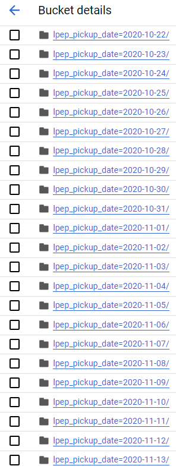

# Module 2 Homework

## Question 1. Data Loading

    Once the dataset is loaded, what's the shape of the data?

>    `ANSWER: 266,855 rows x 20 columns`

## Question 2. Data Transformation

    Upon filtering the dataset where the passenger count is equal to 0 or the trip distance is equal to zero, how many rows are left?

>    `ANSWER: 139,370 rows`

## Question 3. Data Transformation

    Which of the following creates a new column lpep_pickup_date by converting lpep_pickup_datetime to a date?

>    `ANSWER: data['lpep_pickup_date'] = data['lpep_pickup_datetime'].dt.date`

## Question 4. Data Transformation

    What are the existing values of VendorID in the dataset?

>    `ANSWER: 1 or 2`

## Question 5. Data Transformation

    How many columns need to be renamed to snake case?

>    `ANSWER: 4 (VendorID, RatecodeID, PULocationID, DOLocationID)`

## Question 6. Data Exporting

    Once exported, how many partitions (folders) are present in Google Cloud?

>    `ANSWER: 95`

